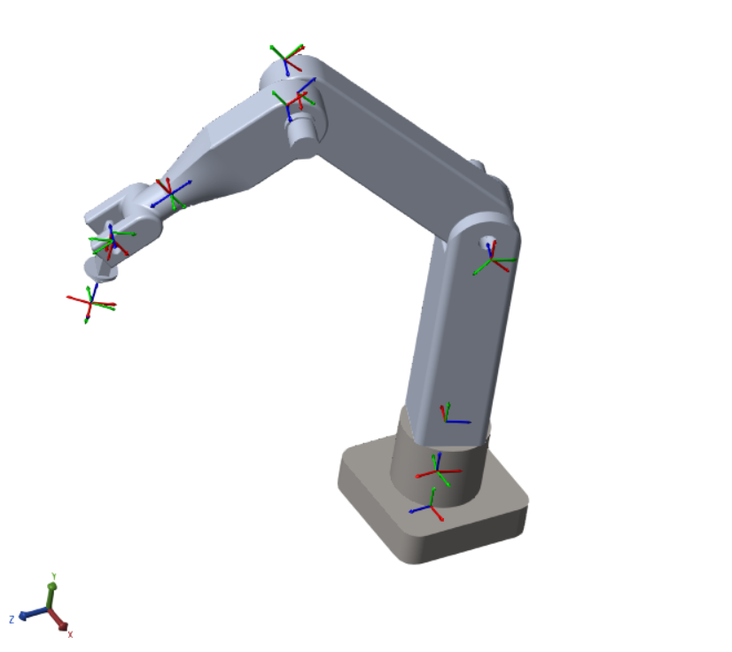
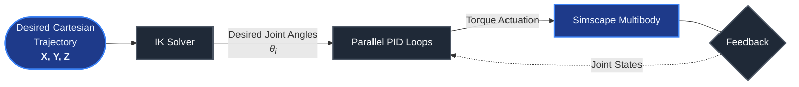
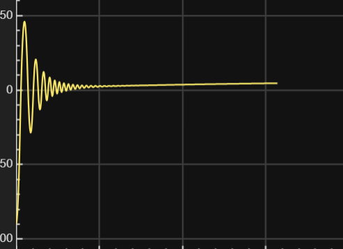
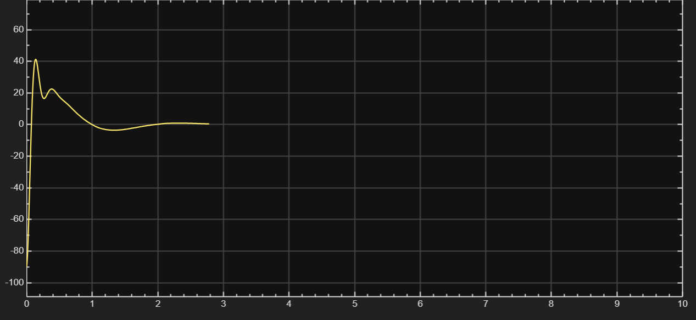
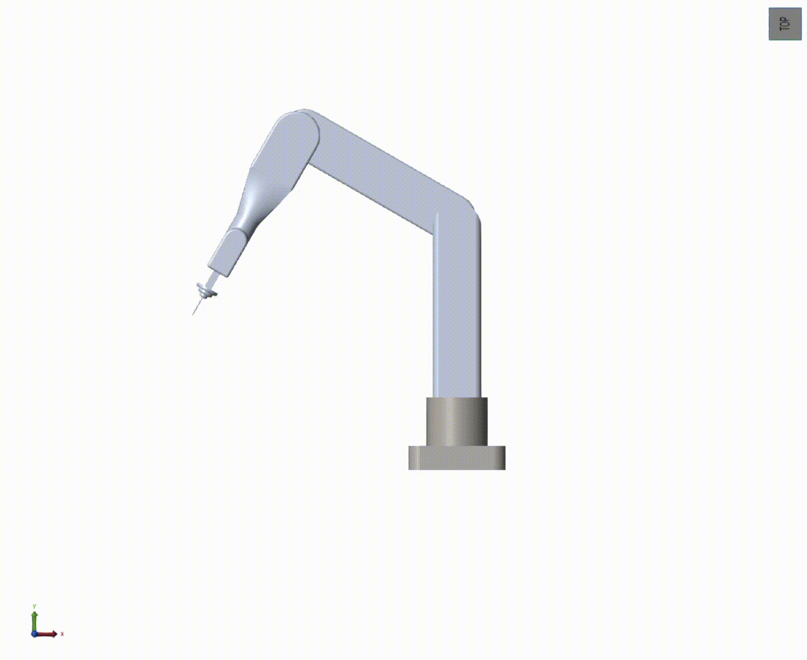

# 5-DOF Robotic Manipulator: Multibody Dynamics & Trajectory Control

An end-to-end simulation, kinematic analysis, and control system design for a 5-Degree-of-Freedom (5-DOF) serial open-chain robotic manipulator, developed in **MATLAB & Simscape Multibody**. 

This project bypasses traditional geometric abstractions to model true rigid-body link dynamics, utilizing hybrid numerical/analytical Inverse Kinematics (IK) for Cartesian positioning and independent parallel PID controllers for joint-space trajectory tracking.

---

## 🚀 Key Technical Highlights

* **Custom High-Performance IK Solver:** Engineered a deterministic, custom analytical-geometric Inverse Kinematics solver using 3D-to-2D spatial dimensionality reduction. By projecting 3D target coordinates into a decoupled 2D planar vector system, the algorithm eliminates the high computational overhead and convergence issues of iterative numerical solvers.
* **High-Fidelity Physical Modeling:** Modeled exact rigid-body link mass, inertia tensors, and joint friction profiles directly within Simscape Multibody, moving beyond pure geometric animations to capture realistic transient dynamics.
* **Robust Control Architecture:** Designed and tuned 5 independent parallel PID controllers engineered to counteract non-linear gravitational loading and inertial cross-coupling torques across multi-axis trajectories.
* **Coordinate-Free Kinematics:** Bypassed rigid, traditional Denavit-Hartenberg (D-H) framing conventions by leveraging Simscape’s free 3D spatial transformations, mapping joint frames explicitly and intuitively to physical CAD intersections.

---

## 🛠️ System Architecture & Mechanical Design

The manipulator consists of a 5-DOF open-chain configuration. All 5 joints are revolute, each rotating about its local Z-axis. 

### Joint Configuration & Work Envelope Limits
| Joint | Type | Axis of Rotation | Motion Range | Purpose / Function |
| :---: | :---: | :---: | :---: | :--- |
| **J1** | Revolute | Local Z | $\pm180^\circ$ | Base Rotation (Yaw) |
| **J2** | Revolute | Local Z | $+20^\circ \text{ to } +350^\circ$ | Shoulder Link (Pitch) |
| **J3** | Revolute | Local Z | $\pm120^\circ$ | Elbow Link (Pitch) |
| **J4** | Revolute | Local Z | $\pm180^\circ$ | Wrist Pitch / Orientation |
| **J5** | Revolute | Local Z | $-45^\circ \text{ to } +225^\circ$ | Wrist Roll / End-Effector Twist |

*Figure 1: Local coordinate frames at joint intersections inside Simscape Multibody, ensuring precise spatial alignment.*

---

## 🧠 Kinematics & Control Loop

The system operates on a closed-loop architecture where desired Cartesian trajectories are mapped to joint space, and executed via localized feedback control.

1. **Inverse Kinematics (IK) Solver:** Designed and implemented a custom analytical-geometric solver that leverages 3D-to-2D dimensionality reduction. By decomposing the 3D spatial vector of the target into a planar 2D system based on the base rotation ($\theta_1$), the non-linear transcendental equations are resolved via geometric vector systems. This approach eliminates the computational overhead of iterative numerical solvers, mapping the Cartesian target coordinates $(X, Y, Z)$ directly and deterministically to the joint space vector:

$$\vec{\theta} = \begin{bmatrix} \theta_1 & \theta_2 & \theta_3 & \theta_4 & \theta_5 \end{bmatrix}^T$$

2. **Trajectory Tracking:** The resolved angles feed into the parallel PID control loops as time-varying setpoints.

---

## 📊 Simulation & Verification

### Transient Performance (PID Tuning)
To overcome gravity loading and multi-link dynamic coupling, the joint actuators were iteratively tuned. Below is the step-response comparison showcasing the elimination of steady-state error and minimization of transient overshoot.

| Before Tuning (Default/Unoptimized) | After Tuning (Optimized Parallel PID) |
|---|---|
<table id="pid-comparison">
  <tr>
    <td align="center">
      <b>Before Tuning (Default/Unoptimized)</b> 
      
       <i>High settling time, steady-state error under gravity.</i>
    </td>
    <td align="center">
      <b>After Tuning (Optimized Parallel PID)</b> 
      
       <i>Critically damped tracking, minimal overshoot, &lt;2% settling time.</i>
    </td>
  </tr>
</table>

### Manipulator Tracking Demo
The complete physical implementation running through a multi-axis tracking profile in the Simscape Mechanics Explorer:

